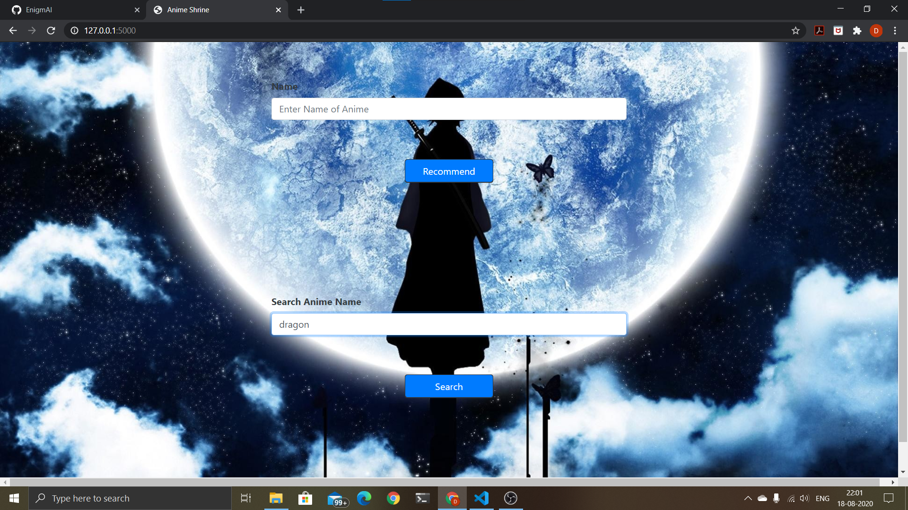
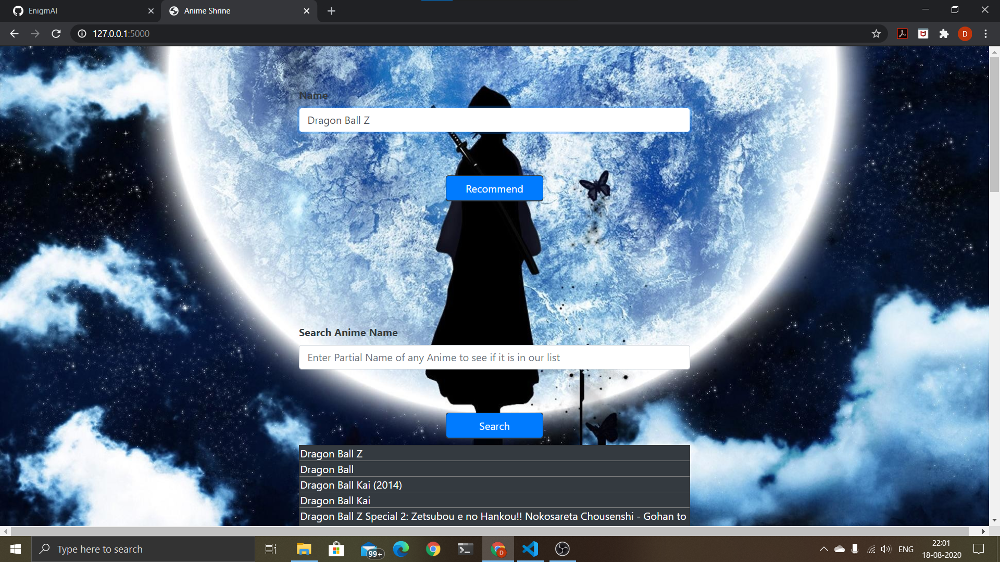
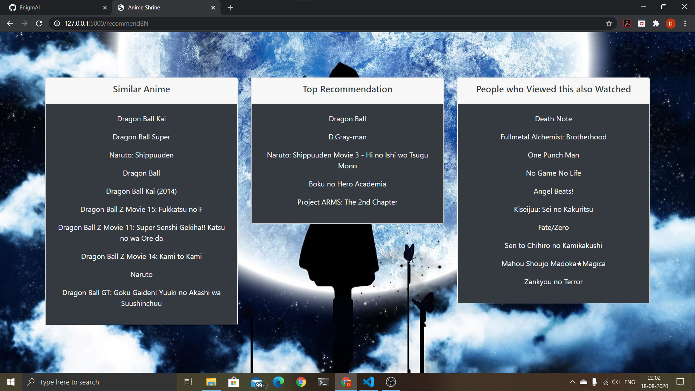

# Anime Shrine

A website made using HTML, CSS, Bootstrap and Flask to recommend anime. We used KNN and K-Means algorithms to give three kinds of recommendations - based on genre, based on user ratings and finally the top recommendations.

## Contributors

- Dhruv Garg
- Aditya Upadhyay

## Installation and Setup

* Fork the repo and clone it.
```
https://github.com/EnigmAI/Anime-Shrine.git
```
* Install the necessary packages required to run the code
* Run the following command
```
python app.py
```
* Next go to your web browser and open the url below
```
http://127.0.0.1:5000/
```
* Now you can use our search option to see which anime are present in our database
* Then just copy name of the anime you like from the search results and press the recommend button
* If you want to learn more about how the ML algorithms have been applied refer the jupyter notebooks inside 'ML models' folder

## Dataset

We used the Anime Recommendations Database available on Kaggle here - https://www.kaggle.com/CooperUnion/anime-recommendations-database.
This data set contains information on user preference data from 73,516 users on 12,294 anime. Each user is able to add anime to their completed list and give it a rating and this data set is a compilation of those ratings.

## Preview


## Images

|    |   |
|:--------------------|:-------------------|
|    |   |
